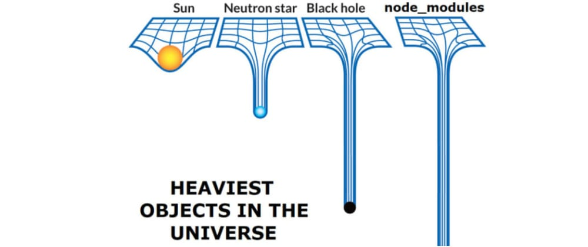

# **Convergence**

- 📦 *Toolkit:* **`Convergence`**
- 🏗️ *Version:* **`7.1.4`**
- 👨‍💻 *Author:* [**VQH-cmd**](https://VQH-cmd.github.io)

<br>

________________________________________________________________

<br>

## **`[01]:` Description**

- A toolkit for **[Monolith](https://github.com/VQH-cmd/Monolith.lite)** template.
- Inspired by: **[Captain Panic! & Systek - [Monolith]: Convergence)](https://captainpanicmonolith.bandcamp.com/track/convergence)**
- **Everything is Connected:** One Package connect to many projects !

<br><br>


<br><hr><br>




<br>

________________________________________________________________

<br>

## **`[02]:` Installation**

💼 *Base*	| 🔗 *Link*
--------	| --------
**Node.js**	| https://nodejs.org (16.x.x)
**gulp.js**	| https://gulpjs.com

<br>

### **Location**
Put the **[Convergence](#)** anywhere in your device.
Ex: `D:/toolkit/Convergence`
<br>

### **Install Commands** (Terminal):

> Recommended !
> ```
> yarn install
> ```
```
npm install
```

<br>

> Use the command `set-executionpolicy remotesigned` in the **Windows Powershell** if you see
> ```
> gulp.ps1 cannot be loaded because running scripts is disabled on this system
> ```
> in the Terminal.

<br>

Then `cd` command it every time using.
Ex:
```
cd D:/toolkit/Convergence
```


<br>

________________________________________________________________

<br>

## **`[03]:` Support**

[HTML](https://www.w3schools.com/html)<br>
[Pug](https://pugjs.org)<br>
[CSS](https://www.w3schools.com/css)<br>
[SASS/SCSS](https://sass-lang.com)<br>
[JavaScript](https://www.w3schools.com/js) (Not Recommended) `[ .js ]`<br>
[TypeScript](https://www.typescriptlang.org) (Recommended) `[ .ts ]`<br>
[React](https://reactjs.org) `[ .jsx .tsx ]`<br>
[PHP](https://www.php.net)<br>
`localhost`<br>
`ftp`<br>
[WordPress](https://wordpress.org)<br>
[Shopify](https://www.shopify.com)<br>
[TheBASE](https://thebase.in)

<br>

________________________________________________________________

<br>

## **`[04]:` Commands & Description**

> Use the **`Terminal`** to execute the commands.

<br>

📟 Overall Commands		| 📝 Description
--------			| --------
`gulp <command> --p <DEST> --env <env>`				| Use the Toolkit.
`ncu`				| Check Update.

<br>

📟 `<command>`		| 📝 Description
--------			| --------
b | Build
w | Watch
css | Run CSS task only
css_c | Run custom CSS task only
js | Run JavaScript task only
js_c | Run custom JavaScript task only
pug | Run Pug task only
ftp | Upload on FTP server
clean | Remove the temporary files
clean_all | Remove all generated files

<br>

📟 `<env>`		| 📝 Description
--------			| --------
`development` / `dev` / `d` | Development *(default, no need to write `--env)`*
`production` / `prod` / `p` | Production

> If [Shopify](https://www.shopify.com), the value in `shopify.yml`

<br>

`<DEST>` = Destination. Example:
<br>
`gulp b --p D:/Project/example_x`
<br>
`gulp b --p D:/Shopify/example_x --env prod`

<br>

________________________________________________________________

<br>

## **`[05]:` Repository tree**

> All files in **`/build`** folder shall be converted into **`/assets`** folder.

<br>

### **`📦` [Pack]: Assets & Build**

+ **`.../`**
	- **`/assets`** *(assets)*
	- **`/build`** *(build)*
		- `/config` *(Config Folder)*
			- `breakpoint.json` (CSS Breakpoint Responsive)
			- `config.json` ([Convergence](#)'s Config)
			- `ftp.json` (FTP Config)
			- `misc.json` (SASS Config)
			- `theme.json` (Themes/Colors Config)
			- `whitelist.json` (PurgeCSS config)
		- `/js` *(JavaScript + TypeScript)*
			- `/components`
			- `/libs` *(JavaScript Library, support {.js, .ts})*
			- `/script` *(shall export individual files)*
			- `script.ts`
		- `/pug` *(Pug)*
		- `/sass` *(SASS)*
			- `/style` *(shall export '\*.style.css' files)*
			- `style.sass`
		- `/img` *(Image [Optional])*
	- **`/docs`** *(identify)*
	- **`.editorconfig`**

<br>

----------------------------------------------------------------

<br>

### **`default`: Front-End, [PHP](https://www.php.net), [WordPress](https://wordpress.org)**

+ **`Project_Name/`** *(also the root)*
	- **`📦[Pack]`**
	- `/data` *(database)*
	- `/docs` *(information about the Project)*
	- `/inc` *(include PHP files)*
	- `/locale` *(internationalization)*
	- `.htaccess`
	- `robots.txt`
	- `...`

<br>

----------------------------------------------------------------

<br>

### **[Shopify](https://www.shopify.com)**

+ **`Project_Name/`** *(also the root)*
	- **`📦[Pack]`**
	- `/config` *(Shopify)*
	- `/layout` *(Shopify)*
	- `/locales` *(Shopify)*
	- `/sections` *(Shopify)*
	- `/snippets` *(Shopify)*
	- `/templates` *(Shopify)*
	- `shopify.yml` *(Shopify config)*

<br>

----------------------------------------------------------------

<br>

### **[TheBASE](https://thebase.in)**

+ **`Project_Name/`** *(also the root)*
	- **`📦[Pack]`**
	- `theme.html` *(result)*

<br>

________________________________________________________________

<br>

## **`[06]:` Download**

Download link in any **Monolith** project via this location:
+ **`Project_Name/`** *(also the root)*
	- **`/build`**
		- `convergence.yml`

<br>

________________________________________________________________

Copyright © 2018 - 2021, [VQH-cmd](https://VQH-cmd.github.io).
